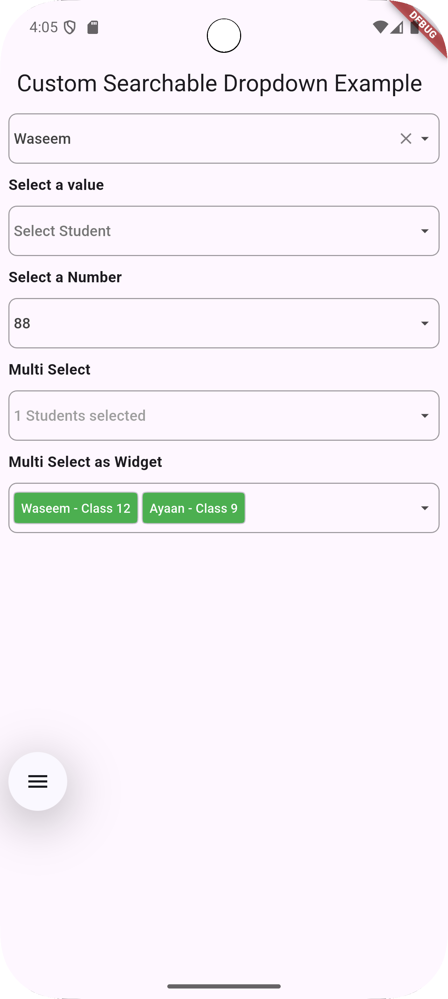
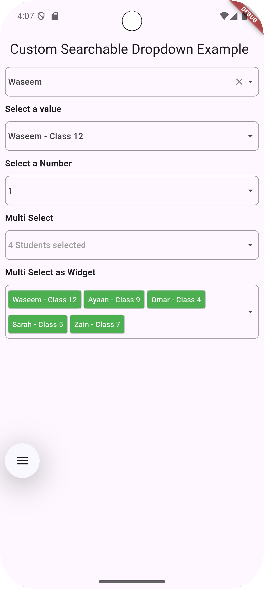

# Custom Searchable Dropdown Widget
The **Custom Searchable Dropdown** widget allows users to search from a dynamic list of data. You can customize the dropdown to suit your needs, and it supports both multiple select and single select options. The widget’s `onChange` event returns the complete list or the index of the selected option.

---

## 📌 Features

✅ Searchable dropdown with instant filtering  
✅ Single and multi-select modes  
✅ Custom styling and theming support  
✅ Async data loading for large datasets  
✅ Support for custom UI widgets inside dropdown

---

## 🏗 Platforms Supported

This widget has been successfully tested on the following platforms:
- ✅ iOS
- ✅ Android

---

## 🎨 Examples

The following examples showcase how the widget works in different modes.

### 📌 Gallery

| Example Name       | Preview Image                                                           |
| ------------------ | --------------------------------------------------------------------- |
| [Menu Mode](#Menu-Mode)      |                               |
| [All DropDown](#All-DropDown) |                                 |
| [MultiSelect DropDown](#MultiSelect-DropDown) |   |

---

## 🛠 Installation

Add this dependency to your `pubspec.yaml`:

```yaml
dependencies:
  custom_searchable_dropdown: latest_version
```

Get packages with command:
```dart
flutter packages get
```

#### Import:
```dart
import 'package:custom_searchable_dropdown/custom_searchable_dropdown.dart';
```

# 📝 Usage
---
#### 🎯 Basic Example
```dart
     CustomSearchableDropDown(
        items: ["Apple", "Banana", "Cherry", "Date"],
        label: "Select a fruit",
        onChanged: (value) {
        print("Selected: $value");
        },
     );
```

#### 🏷 Menu Mode
```dart
         CustomSearchableDropDown(
              dropdownHintText: 'Search For Name Here... ',
              showLabelInMenu: true,
              primaryColor: Colors.red,
              menuMode: true,
              labelStyle: TextStyle(
                color: Colors.red,
                fontWeight: FontWeight.bold
              ),
              items: listToSearch,
              label: 'Select Name',
              prefixIcon:  Padding(
                padding: const EdgeInsets.all(0.0),
                child: Icon(Icons.search),
              ),
              dropDownMenuItems: listToSearch?.map((item) {
                return item['name'];
              })?.toList() ??
                  [],
              onChanged: (value){
                if(value!=null)
                {
                  selected = value['class'].toString();
                }
                else{
                  selected=null;
                }
              },
           ),
```

#### 🎯 Single Select Mode
```dart
     CustomSearchableDropDown(
           items: listToSearch,
           label: 'Select Name',
           decoration: BoxDecoration(
               border: Border.all(
                   color: Colors.blue
               )
           ),
           prefixIcon:  Padding(
             padding: const EdgeInsets.all(0.0),
             child: Icon(Icons.search),
           ),
           dropDownMenuItems: listToSearch?.map((item) {
             return item['name'];
           })?.toList() ??
               [],
           onChanged: (value){
             if(value!=null)
             {
               selected = value['class'].toString();
             }
             else{
               selected=null;
             }
           },
        ),
```
####  🎯 Multi Select 
```dart
      CustomSearchableDropDown(
             items: listToSearch,
             label: 'Select Name',
             multiSelectTag: 'Names',
             decoration: BoxDecoration(
                 border: Border.all(
                     color: Colors.blue
                 )
             ),
             multiSelect: true,
             prefixIcon:  Padding(
               padding: const EdgeInsets.all(0.0),
               child: Icon(Icons.search),
             ),
             dropDownMenuItems: listToSearch?.map((item) {
               return item['name'];
             })?.toList() ??
                 [],
             onChanged: (value){
               if(value!=null)
               {
                 selectedList = jsonDecode(value);
               }
               else{
                 selectedList.clear();
               }
             },
           ),
```

#### 🎯 Multi Select as Widget Mode
```dart
     CustomSearchableDropDown(
          initialValue: [
            {
              'parameter': 'name',
              'value': 'Sam',
            },
            {
              'parameter': 'name',
              'value': 'flutter',
            },
          ],
          items: listToSearch,
          label: 'Select Name',
          multiSelectTag: 'Names',
          multiSelectValuesAsWidget: true,
          decoration: BoxDecoration(
            border: Border.all(
              color: Colors.blue
            )
          ),
          multiSelect: true,
          prefixIcon:  Padding(
            padding: const EdgeInsets.all(0.0),
            child: Icon(Icons.search),
          ),
          dropDownMenuItems: listToSearch?.map((item) {
            return item['name'];
          })?.toList() ??
              [],
          onChanged: (value){
            print(value.toString());
            if(value!=null)
            {
              selectedList = jsonDecode(value);
            }
            else{
              selectedList.clear();
            }
          },
         ),"# csd" 


## 🔧 Customization Options

| Property        | Type         | Description                                  |
|--------------- |-------------|----------------------------------------------|
| `items`        | `List<T>`    | List of items to display in the dropdown.   |
| `label`        | `String`     | Placeholder text for the dropdown.          |
| `onChanged`    | `Function(T)`| Callback when an item is selected.          |
| `multiSelect`  | `bool`       | Enables multi-selection mode.               |
| `searchHint`   | `String`     | Hint text for the search field.             |
| `primaryColor` | `Color`      | Sets the main theme color of the dropdown.  |
| `menuMode`     | `bool`       | Enables menu mode for dropdown display.     |
