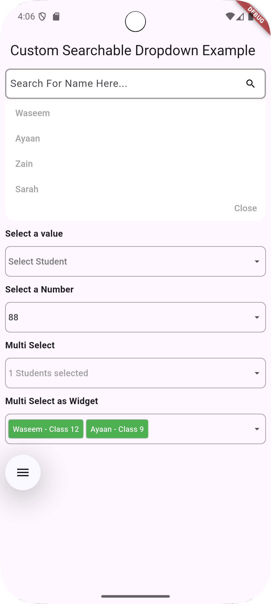

# Custom Searchable Dropdown Widget
The **Custom Searchable Dropdown** widget allows users to search from a dynamic list of data. You can customize the dropdown to suit your needs, and it supports both multiple select and single select options. The widget’s `onChange` event returns the complete list or the index of the selected option.

---

## 📌 Features

✅ Searchable dropdown with instant filtering  
✅ Single and multi-select modes  
✅ Custom styling and theming support  
✅ Async data loading for large datasets  
✅ Support for custom UI widgets inside dropdown

---

## 🏗 Platforms Supported

This widget has been successfully tested on the following platforms:
- ✅ iOS
- ✅ Android

---

## 🎨 Examples

The following examples showcase how the widget works in different modes.

### 📌 Gallery

| Example Name       | Preview Image                                                           |
| ------------------ | --------------------------------------------------------------------- |
| [Menu Mode](#Menu-Mode)      |                               |
| [All DropDown](#All-DropDown) |                                 |
| [MultiSelect DropDown](#MultiSelect-DropDown) |   |

---

## 🛠 Installation

Add this dependency to your `pubspec.yaml`:

```yaml
dependencies:
  custom_searchable_dropdown: latest_version
```

Get packages with command:
```dart
flutter pub add custom_searchable_dropdown
```

#### Import:
```dart
import 'package:custom_searchable_dropdown/custom_searchable_dropdown.dart';
```

# 📝 Usage
---
#### 🎯 Basic Example
```dart
     CustomSearchableDropDown(
        items: ["Apple", "Banana", "Cherry", "Date"],
        label: "Select a fruit",
        onChanged: (value) {
        print("Selected: $value");
        },
     );
```

#### 🏷 Menu Mode
```dart
        CustomSearchableDropDown<Student>(
              dropdownHintText: 'Search For Name Here...',
              menuMode: true,
              showLabelInMenu: true,
              showClearButton: true,
              initialValue: [studentList.first],
              items: studentList,
              // Use a display callback to define how each Student is shown.
              displayItem: (Student student) => '${student.name}',
              onChanged: (value) => setState(() {
                // Since onChanged is dynamic, we check the type.
                if (value != null && value is Student) {
                  selected = value.studentClass.toString();
                } else {
                  selected = null;
                }
              }),
            ),
```

#### 🎯 Single Select Mode
```dart
       CustomSearchableDropDown<Student>(
              items: studentList,
              label: 'Select Student',
              showLabelInMenu: true,
              // prefixIcon: Padding(padding: const EdgeInsets.all(0.0), child: Icon(Icons.search)),
              displayItem: (Student student) => '${student.name} - Class ${student.studentClass}',
              onChanged: (value) => setState(() {
                if (value != null && value is Student) {
                  selected = value.studentClass.toString();
                } else {
                  selected = null;
                }
              }),
            ),
```
####  🎯 Multi Select 
```dart
      CustomSearchableDropDown<Student>(
              items: studentList,
              label: 'Select Student',
              multiSelectTag: 'Students',
              multiSelect: true,
              displayItem: (Student student) => '${student.name} - Class ${student.studentClass}',
              onChanged: (value) => setState(() {
                // For multi-select, onChanged returns a JSON encoded list.
                if (value != null && value is String) {
                  selectedList = jsonDecode(value);
                } else {
                  selectedList.clear();
                }
              }),
            ),
```

#### 🎯 Multi Select as Widget Mode
```dart
    CustomSearchableDropDown<Student>(
              initialValue: [studentList.first, studentList[1]],
              items: studentList,
              label: 'Select Student',
              multiSelectTag: 'Students',
              multiSelectValuesAsWidget: true,
              multiSelect: true,
              displayItem: (Student student) => '${student.name} - Class ${student.studentClass}',
              onChanged: (value) => setState(() {
                if (value != null && value is String) {
                  print(value.toString());
                  selectedList = jsonDecode(value);
                } else {
                  selectedList.clear();
                }
              }),
            ),
```


### List And json
```dart
///
/// DATA MODEL
///
class Student {
  final String name;
  final int studentClass; // Renamed from 'class' since it's reserved.
  Student({required this.name, required this.studentClass});
  factory Student.fromMap(Map<String, dynamic> map) => Student(name: map['name'], studentClass: map['class'] as int);
  Map<String, dynamic> toJson() => {'name': name, 'age': studentClass};

  Map<String, dynamic> toMap() => {'name': name, 'class': studentClass};
  @override
  String toString() => name;
}

  // Sample data as a list of maps.
  List<Map<String, dynamic>> listToSearch = [
    {'name': 'Waseem', 'class': 12},
    {'name': 'Ayaan', 'class': 9},
    {'name': 'Zain', 'class': 7},
    {'name': 'Sarah', 'class': 5},
    {'name': 'Omar', 'class': 4},
    {'name': 'Layla', 'class': 3}
  ];
```

------

## 🔧 Customization Options

| Property        | Type         | Description                                  |
|--------------- |-------------|----------------------------------------------|
| `items`        | `List<T>`    | List of items to display in the dropdown.   |
| `label`        | `String`     | Placeholder text for the dropdown.          |
| `onChanged`    | `Function(T)`| Callback when an item is selected.          |
| `multiSelect`  | `bool`       | Enables multi-selection mode.               |
| `searchHint`   | `String`     | Hint text for the search field.             |
| `primaryColor` | `Color`      | Sets the main theme color of the dropdown.  |
| `menuMode`     | `bool`       | Enables menu mode for dropdown display.     |
